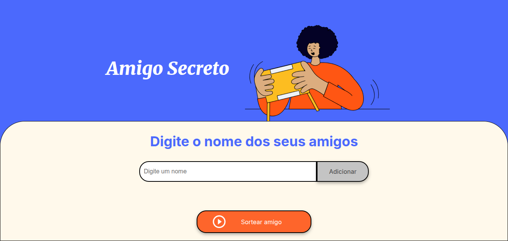

<h1 align="center">🚀 Challenge Amigo Secreto</h1>

  

[Link da Página](https://rodrigosan003.github.io/challenge-amigo-secreto/)

  Adiciona uma lista de nomes e sorteia um nome para amigo secreto.

---

## 📖 Sobre

Uma página para selecionar uma lista de nomes e sortear para um amigo secreto.

- 1 - Digite nome no campo "Digite um nome".
- 2 - Clique em adicionar e, posteriormente, coloque mais um nome. (deve colocar no mínimo dois nomes)
- 3 - Com os nomes adicionados, clique no botão "Sortear amigo" para obter o nome do amigo secreto.

---

## 🛠 Tecnologias

As principais tecnologias usadas foram:

- HTML5
- CSS3
- JavaScript

---

## 📄 Licença

Este projeto está sob a licença MIT.

 Feito com ❤️ por <a href="https://github.com/rodrigosan003/">Rodrigo Anastácio</a> 

